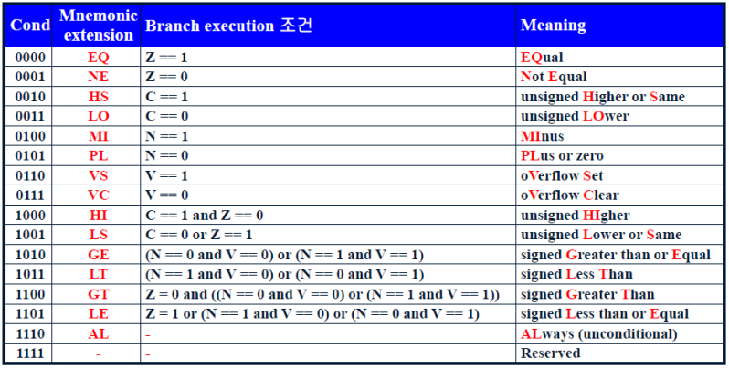

# ARM Assembly CheatSheet

ARMA 어셈블리 명령어

## 1. 산술 연산

```assembly
ADD R0, R1, #0x1
```

R1에 0x1을 더한 값을 R0에 저장


## 2. 비트 연산

```assembly
AND R0, R1, #0x2
```

R1에 0x2를 AND 연산해서 그 결과값을 R0에 저장


## 3. 대입 연산

```assembly
MOV R0, #100
```

R0 레지스터에 숫자 상수 100 을 저장

```assembly
MOV R0, R1
```

R0 레지스터에 R1 레지스터 값을 저장


## 4. 시프트 연산

```assembly
LSL R0, R1, #0x2
```

R1 레지스터 값을 Left로 2 bit shift 한 값을 R0에 저장

※ LSR은 오른쪽으로 bit shift


## 5. 분기 명령

```assembly
B 1f
B .
```

위의 명령어는 아래에 나오는 1: 라벨로 점프

아래 명령어는 무한 루프 (.은 제자리를 의미)

※ 아래는 BNE, BEQ 등 해석할 때 필요한 조건

[](https://m.blog.naver.com/PostView.naver?isHttpsRedirect=true&blogId=mayooyos&logNo=220830008603)


## 6. 비교 연산

```assembly
CMP R0, R1
BEQ 1f
B 2f
```

R0-R1 을 수행하여 0이 나온다면 (= 값이 같다면) 1로 점프, 아니라면 2로 점프

결과값이 0이라면 CPSR 레지스터의 Z 비트는 1로 SET, 1이라면 Z 비트는 0으로 SET

```assembly
TST R0, #1 << 2
BNE 1f
B 2f
```

R0 와 0x4 를 AND 연산한 결과를 CPSR (상태 레지스터) Flag 에 저장

위 연산 결과 참이라면 (= & 연산 결과가 1이라면) Z 비트가 0으로 SET, 0이라면 Z 비트는 1로 SET

참이라면 위 예시에서는 1로 점프


## 7. 메모리 연산

```assembly
LDR R0, =0x100
```

R0 에 숫자 0x100 을 저장

```assembly
LDR R0, [R1]
```

R1 가 가리키는 메모리 주소의 값을 R0 레지스터에 저장

```assembly
MOV R0, #0x100
MOV R1, #0xFF
STR R1, [R0]
```

0x100 번지 (R0) 에 0xFF (R1) 를 저장 ([] 괄호를 쓰면 메모리 주소를 가리킴)

```assembly
STR R1, [R0, #4]
STR R1, [R0], #4
```

위에 명령어는 R0 + 4 번지에 R1 레지스터 값을 저장

아래 명령어는 R0 번지에 R1 레지스터 값을 저장하고 R0 주소값을 +4 증가